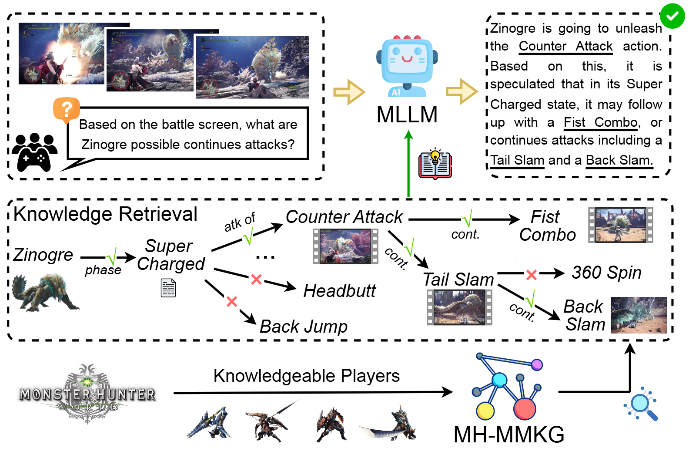

# Taming the Untamed: Graph-Based Knowledge Retrieval and Reasoning for MLLMs to Conquer the Unknown
This repository is the official implementation of [MH-Benchmark](https://arxiv.org/abs/2506.17589). It contains the codes for constructing the MH-MMKG, running the baseline method (multi-agent self-search) as well as automatic evaluation. 
Our dataset aims to assess the ability of MLLMs in searching knowledge from MMKG for domain specific tasks.


## Data Set
You can access our dataset for [MH-MMKG](https://drive.google.com/file/d/149ZGV780sVjjiTWfCYj2G8ovOz1KQJeF/view?usp=drive_link) and questions in our [MH-Benchmark](https://drive.google.com/file/d/1us29Gd3kjl_fRL4INk3eAqfSbAyqq9AE/view?usp=drive_link).
Please download and set them under the project home. Our MH-MMKG is saved in separate Excel files (Node.xlsx for entity information and Relation.xlsx for relation between entities) for each sub-graph. All source videos for the dataset are also available for reasonable requests.
You can use the following function to construct the MH-MMKG into a dict structure.
```
from things.graph_construction import construct_graph
nodes_aggregation, relation_aggregation = construct_graph(your_root, offline_file2="", mode="Perfect")
```

## Implementation of Baseline (multi-agent self-search) Experiment
There are totally 6 modes corresponding to the experiment setting in the ICCV 2025 paper. You can also set mode as "all" to run all 6 settings in sequence.
```
mode = ["Direct Vision-needed", "Direct", "Perfect", "self Search", "Offline", "Online Vision-needed"]
```

#### Experiment with GPT-4o for example
There is a pre-extract for "Offline" to get all images/videos caption in both MH-MMKG and questions. Using the following command for generation. Two files of "questions_mh/question_offline_gpt-4o-2024-11-20.json" and "mmkg/kg_offline_gpt-4o-2024-11-20.json" will be generated. You can also simply change the provided close-source models to your open-source models by revising the "model_options.py" file.
```
python  offline_prepare.py --dataset_dir your_root --model_name gpt-4o-2024-11-20 --api_key your_api
```

We use a multi-agent self-search for knowledge retrieval and answer augmentation (all prompts template is shown at "things/templates.py"). There is an image compression process to convert all 4k images into the size for a model's input limitation (see model_options.py, default 1k). Using the following command for the calculation of all questions in MH-Benchmark. A file of "results/gpt-4o-2024-11-20_{mode}" will be generated. Each prediction is  consisted of the searched knowledge and final answer.
```
python  main.py --dataset_dir your_root --mode select_a_mode --model_name gpt-4o-2024-11-20 --api_key your_api
```

## Automatic Evaluation
We use the GPT-4o for this evaluation. Our prompts refer to "things/templates.py" with functions: evaluation_temp().

#### Evaluation for Completeness and Faithfulness
An evaluation file "evaluation.json" will be generated for all prediction (with the metric if answer correctness and search route similarity). 
Run the following comment for evaluation.
```
python  evaluation.py --dataset_dir your_root --mode select_a_mode --model_name gpt-4o-2024-11-20 --api_key your_api
```

## Publication
If you want to use this work, please consider citing the following paper.
```
@inproceedings{wang2025taming,
 title = {Taming the Untamed: Graph-Based Knowledge Retrieval and Reasoning for MLLMs to Conquer the Unknown},
 author = {Wang, Bowen and Jiang, Zhouqiang and Susumu, Yasuaki and Miwa, Shotaro and Chen, Tianwei and Nakashima, Yuta},
 booktitle = {International Conference on Computer Vision (ICCV)},
 year = {2025}
}
```
